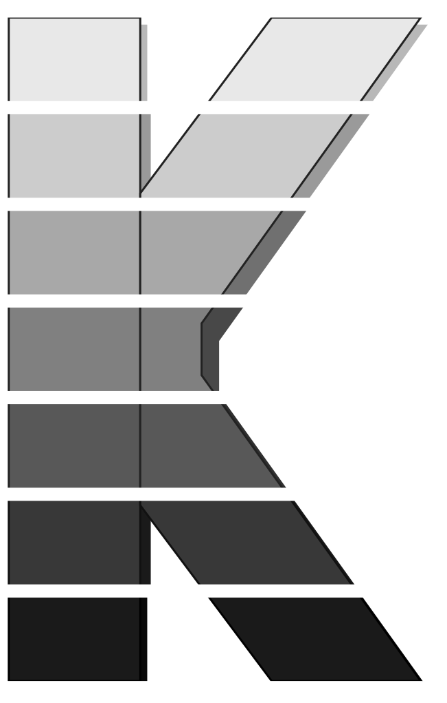

# kstack

*Skill pack for Claude Code that helps you monitor your K8s clusters superintelligently*



<a href="https://discord.gg/CmsmWAVkvX"></a>
[](https://kubernetes.slack.com/archives/C08SHG1GR37)
[](CODE_OF_CONDUCT.md)
[](https://github.com/kubetail-org)

English | [简体中文](.github/README.zh-CN.md) | [日本語](.github/README.ja.md) | [한국어](.github/README.ko.md) | [Deutsch](.github/README.de.md) | [Español](.github/README.es.md) | [Português](.github/README.pt-BR.md) | [Français](.github/README.fr.md)

## Introduction

**Kstack** is a skill pack for Claude Code that helps you perform monitoring, troubleshooting and auditing tasks on your K8s clusters in a smart and efficient way. Alongside standard tools like `kubectl`, kstack uses [`kubetail`](https://github.com/kubetail-org/kubetail) to process container logs remotely at the source before sending it back to Claude for analysis which makes monitoring with Claude faster and more token efficient. Kstack also detects the services running in your cluster and uses their specialized tooling when necessary (e.g. Argo, Cilium) which makes Claude more capable.

Once you install kstack you'll have access to these skills inside Claude Code:

**Monitoring**
* `/cluster-status` — Health snapshot (pod restarts, node conditions, resource pressure)
* `/events` — Recent events, ranked by severity
* `/watch <resource>` — Background watcher (pings Claude only on state changes)

**Troubleshooting**
* `/investigate <resource>` — Root-cause analysis across events, logs, and related resources
* `/exec <pod>` — Guided shell with diagnostics preloaded; ephemeral debug container for scratch/distroless
* `/logs` — Fetch container logs with remote grep via [Kubetail](https://github.com/kubetail-org/kubetail)

**Audits**
* `/audit-security` — RBAC, pod security posture, privilege tightening
* `/audit-network` — NetworkPolicy, Service, Ingress, GatewayAPI, DNS and encryption checks
* `/audit-cost` — Requests vs. usage, over-provisioning, idle capacity
* `/audit-outdated` — Outdated services, known CVEs, available version bumps

**Miscellaneous**
* `/cleanup-cluster` — Remove all kstack-owned resources from the cluster (debug containers, pod clones, watcher jobs)
* `/forget` — Clear kstack's local cache and discard what it learned about your cluster(s)

Our goal is to bring the power of AI to K8s monitoring in a user-friendly and cost-effective way that keeps you in control. If you notice a bug or have a suggestion please create a GitHub Issue or send us an email (hello@kubetail.com)!

## Quickstart

To install kstack globally so you can use the skills from inside any project run:

```console
curl -sS https://kubestack.xyz/install.sh | bash
```

Alternatively, you can install kstack locally so the skills are only available from inside one project directory:

```console
mkdir myproject && cd myproject
curl -sS https://kubestack.xyz/install.sh | bash -s -- --local
```

The bootstrap script installs the kstack skills into your global/local Claude skills directory (e.g. `~/.claude/skills`), prefixing the skill names with `kstack-`. It also detects other available agents (e.g. Codex, OpenCode) and installs the skills into their skills directories as well. Once installed, the skills are available in any project session:

```console
───────────────────────────────────
> /kstack-cluster-status
───────────────────────────────────
```

Kstack uses your local `kubeconfig` file for authentication so it will be able to use your RBAC permissions to perform actions on your behalf. If it runs into permissions problems, it will let you know.

## Other AI Agents

Kstack works with any AI agent that supports skills, not just Claude. The curl bootstrap auto-detects which agent CLIs are on your `PATH` and installs for each. You can target a specific agent with `--agent <name>`:

| Agent            | Flag               | Global install path                   |
|------------------|--------------------|---------------------------------------|
| OpenAI Codex CLI | `--agent codex`    | `~/.codex/skills/kstack-*/`           |
| OpenCode         | `--agent opencode` | `~/.config/opencode/skills/kstack-*/` |
| Cursor           | `--agent cursor`   | `~/.cursor/skills/kstack-*/`          |
| Factory Droid    | `--agent factory`  | `~/.factory/skills/kstack-*/`         |
| Slate            | `--agent slate`    | `~/.slate/skills/kstack-*/`           |
| Kiro             | `--agent kiro`     | `~/.kiro/skills/kstack-*/`            |
| Hermes           | `--agent hermes`   | `~/.hermes/skills/kstack-*/`          |

Local installs mirror this structure under the project directory (e.g. `<project>/.codex/skills/kstack-*/`) and are picked up only when the agent is run from inside that directory.

## Skills Reference

Each skill is invoked with `/<name>` inside an agent session. All skills are read-only by default — any action that mutates cluster state requires explicit confirmation. Skills honor your local `kubeconfig` context and respect RBAC.

**Global flags** (supported by every skill):

| Flag              | Description                                                              |
|-------------------|--------------------------------------------------------------------------|
| `--context <ctx>` | Override the current kubeconfig context                                  |
| `--namespace <n>` | Scope the run to a single namespace (defaults to all accessible)         |
| `--json`          | Emit structured output for piping into other tools                       |
| `--dry-run`       | Print the commands kstack would run without executing them               |
| `--help`          | Print the skill's usage (arguments, options, examples) and exit          |

---

### Monitoring

<dl>
<dt>

#### `/cluster-status`

</dt>
<dd>

Health snapshot across the entire cluster.

**What it checks:** pod phase distribution, restart counts, node `Ready`/`MemoryPressure`/`DiskPressure`/`PIDPressure` conditions, unschedulable pods, workload replica drift (desired vs. ready), and PDB violations.

**How it works:** a single fan-out of `kubectl get` calls with server-side field selectors, aggregated client-side. Summarization is delta-aware — on repeat runs, agent highlights what changed rather than reprinting the full snapshot.

**Options:**
- `--refresh` — fetch most recent data, bypassing and refreshing the cache (default: `false`)
- `--ttl <duration>` — only update the cache if older than `<duration>` (default: `15m`)

</dd>
<dt>

#### `/events`

</dt>
<dd>

Recent cluster events, ranked by severity and deduplicated.

**What it checks:** `Warning` and `Normal` events from the Events API, grouped by `(reason, involvedObject.kind, namespace)` with occurrence counts. Noisy reasons (`Pulled`, `Created`, `Started`) are collapsed.

**How it works:** pulls from the `events.k8s.io/v1` API with server-side sorting by `lastTimestamp`. For clusters with an events exporter (e.g. kubernetes-event-exporter, Loki), `/events` detects and queries the backend instead of the short-lived in-cluster store.

**Options:**
- `--since <duration>` — window size (default `1h`)
- `--reason <regex>` — restrict to matching reasons
- `--object <kind/name>` — narrow to a single resource's event stream

</dd>
<dt>

#### `/watch <resource>`

</dt>
<dd>

Long-running background watcher that pings agent only when state changes.

**What it does:** starts a detached watcher (shell loop + filter script) that streams `kubectl get --watch` for the target resource. The filter compares each update to the previous state hash and only notifies agent on meaningful changes: phase transitions, restart count increments, replica drift, new `Warning` events, node condition flips.

**Why it's cheap:** while the resource stays healthy, the model isn't in the loop — idle token cost is effectively zero. Agent only enters the conversation when the filter fires.

**Arguments:**
- `<resource>` — any of `pod/<name>`, `deployment/<name>`, `node/<name>`, `namespace/<ns>`, or `cluster` for cluster-wide

**Options:**
- `--for <duration>` — auto-stop after N (default: until user cancels)
- `--threshold <level>` — minimum severity to ping on (default `warning`)
- `--quiet` — suppress heartbeat pings; only notify on anomalies
- `--list` / `--stop <id>` — manage active watchers

</dd>
</dl>

---

### Troubleshooting

<dl>
<dt>

#### `/investigate <resource>`

</dt>
<dd>

Root-cause analysis for a failing or suspicious resource.

**What it does:** gathers the resource spec, current + previous container statuses, recent events for the object and its owners, logs from failed/previous containers, related resources (ConfigMaps, Secrets, PVCs, Services, NetworkPolicies), and the last N changes from the revision history. Correlates signals into a ranked list of likely causes.

**Special cases:** for pods in `Pending`, `CrashLoopBackOff`, `OOMKilled`, `ImagePullBackOff`, or `Error` states, the skill jumps straight to the state-specific diagnostic path (node capacity + taints for Pending, prior-instance logs for CrashLoop, memory limits + workingset for OOM, image registry auth for ImagePull).

**Arguments:**
- `<resource>` — `<kind>/<name>` (e.g. `pod/api-7d9`, `deployment/web`, `ingress/public`)

**Options:**
- `--depth <n>` — how many hops of related resources to follow (default `2`)
- `--since <duration>` — log/event lookback window (default `1h`)
- `--compare <revision>` — diff current state against a prior revision

</dd>
<dt>

#### `/exec <pod>`

</dt>
<dd>

Guided shell into a pod's container with diagnostics pre-loaded.

**What it does:** opens an interactive `kubectl exec` session. Before handing you the prompt, agent runs a lightweight probe (`ls /bin/sh`, env dump, DNS resolution of in-cluster services) and reports what's available. A history of common diagnostics (`nslookup`, `curl` to service endpoints, `env | grep`, `cat /proc/1/status`) is primed so you can recall with arrow-up.

**Scratch/distroless fallback:** if the target container has no shell, kstack transparently switches to `kubectl debug --target=<container> --image=<toolbox>` (default toolbox: `nicolaka/netshoot` for network issues, `busybox` otherwise). The debug container shares the target's PID namespace, so `/proc/1/root` gives you the scratch container's filesystem.

**Arguments:**
- `<pod>` — pod name, optionally `<pod>/<container>`

**Options:**
- `--toolbox <image>` — override the debug container image
- `--copy-to <name>` — clone the pod (useful when the original is crashlooping)
- `--node` — drop to a shell on the pod's *node* instead of the container

</dd>
<dt>

#### `/logs`

</dt>
<dd>

Fetch and filter container logs with Kubetail's remote grep feature.

**Why it matters:** `kubectl logs` streams the entire log to the client before you can filter it — on chatty services this is both slow and an expensive number of tokens to hand to agent. Kstack routes through [`kubetail`](https://github.com/kubetail-org/kubetail), which runs a Rust-powered regex filter on the node where the log lives and only sends matching lines back. This can reduce transferred data dramatically.

**Arguments (all optional, composable):**
- `--selector <label>` — label selector across pods (e.g. `app=api`)
- `--pod <name>` / `--container <name>` — narrow scope
- `--grep <regex>` — node-side filter (required for large log volumes)
- `--since <duration>` — lookback window (default `15m`)
- `--tail <n>` — last N lines
- `--follow` — stream new matches as they arrive
- `--level <level>` — shorthand for common log-level regexes (`error`, `warn`, `info`)

</dd>
</dl>

---

### Audits

All audit skills produce a ranked findings list (severity + evidence + suggested fix) and can emit SARIF via `--format sarif` for CI integration.

<dl>
<dt>

#### `/audit-security`

</dt>
<dd>

RBAC review, pod security posture, and privilege-tightening recommendations.

**What it checks:**
- **RBAC:** overly broad ClusterRoles, `*` verbs, wildcard resource access, service accounts with cluster-admin, unbound roles, stale bindings to deleted principals
- **Pod security:** containers running as root, missing `securityContext`, privileged containers, `hostNetwork`/`hostPID`/`hostIPC`, writable root FS, dangerous capabilities (`CAP_SYS_ADMIN`, `CAP_NET_ADMIN`), missing `seccompProfile`
- **Secrets:** secrets mounted but unused, secrets referenced in env vars (vs. mounted files), unencrypted etcd (when detectable)

**Detected integrations:** Kyverno, OPA/Gatekeeper, Falco — surfaces existing policy violations instead of re-scanning.

**Options:**
- `--standard <ps>` — Pod Security Standard level (`privileged`, `baseline`, `restricted`)
- `--fix` — emit patched manifests alongside findings

</dd>
<dt>

#### `/audit-network`

</dt>
<dd>

NetworkPolicy, Service, Ingress, Gateway API, DNS, and encryption sanity checks.

**What it checks:**
- **NetworkPolicies:** namespaces with no default-deny, pods matched by zero policies, policies referencing nonexistent labels, redundant/shadowed rules
- **Services:** Services with no matching endpoints, selectors that hit zero pods, ports mismatched with pod `containerPort`, headless services without StatefulSet
- **Ingress / Gateway API:** hostname collisions, missing TLS, unreferenced certs, backends pointing at missing services
- **DNS:** CoreDNS health, NXDOMAIN rates, stub domains, custom `resolv.conf` drift
- **Encryption:** mTLS coverage when a service mesh is detected (Istio, Linkerd, Cilium)

**Detected integrations:** Cilium (Hubble flow data), Istio, Linkerd.

**Options:**
- `--graph` — emit a Graphviz/Mermaid diagram of service connectivity
- `--probe` — actively test reachability between labeled pods (read-only traffic)

</dd>
<dt>

#### `/audit-cost`

</dt>
<dd>

Resource waste and right-sizing recommendations.

**What it checks:** requests vs. p95 actual usage (7-day window), workloads with no `resources.requests`, idle nodes, PVCs with zero read/write activity, over-provisioned HPAs (min=max), LoadBalancer services with no traffic, unused PVs.

**Data sources:** metrics-server for short-window data; if Prometheus/VictoriaMetrics is detected, pulls a longer history. If [OpenCost](https://www.opencost.io/) is installed, findings include dollar estimates.

**Options:**
- `--window <duration>` — lookback for usage stats (default `7d`)
- `--min-savings <usd>` — suppress findings below a dollar threshold (requires OpenCost)
- `--namespace <n>` — scope to one namespace for team-level reports

</dd>
<dt>

#### `/audit-outdated`

</dt>
<dd>

Outdated cluster components, known CVEs, and available version bumps.

**What it checks:**
- **Kubernetes itself:** control-plane and node versions vs. latest stable/LTS, version skew across components, end-of-support dates
- **Workloads:** container image tags vs. latest upstream, digest freshness, Helm releases with newer chart versions available, operators/CRDs behind their controller versions
- **Known vulnerabilities:** cross-references running images against CVE feeds (Trivy DB by default, Grype optional); correlates CVEs to actually-reachable code paths when an SBOM is available
- **Deprecated APIs:** manifests using API versions that are deprecated or removed in the next K8s minor

**Data sources:** GitHub/GHCR/quay.io for upstream versions, Trivy DB for CVEs, Helm repo indexes for chart versions, the cluster's own Discovery API for deprecated-API usage.

**Options:**
- `--severity <level>` — minimum CVE severity to report (`low`, `medium`, `high`, `critical`)
- `--target-version <ver>` — "if I upgraded to K8s X.Y, what would break?" mode
- `--include-prereleases` — surface alpha/beta upstream versions
- `--fix` — emit updated manifests/values files with new versions pinned

</dd>
</dl>

---

### Maintenance

<dl>
<dt>

#### `/cleanup-cluster`

</dt>
<dd>

Remove all kstack-managed resources from the cluster.

**What it removes:** anything labeled `kstack.kubetail.com/owned-by=kstack` — ephemeral debug containers from `/exec`, pod clones created with `--copy-to`, watcher Jobs and ConfigMaps from `/watch`, toolbox pods, and any temporary RBAC bindings kstack created for them. Resources you authored by hand are never touched, even if they live in the same namespace.

**Labels kstack writes** on every resource it creates (these power the filter flags below):
- `kstack.kubetail.com/owned-by=kstack` — the cleanup selector; presence of this label is what makes a resource a candidate
- `kstack.kubetail.com/skill=<exec|watch|...>` — which kstack skill created the resource (powers `--skill`)
- `kstack.kubetail.com/session=<id>` — the agent session that created it (powers `--session` / `--this-session`)

**Annotations kstack writes** (non-selectable metadata read client-side after the label selector narrows the candidate set):
- `kstack.kubetail.com/created-at=<rfc3339>` — creation timestamp written by kstack itself, since `metadata.creationTimestamp` can be rewritten by admission controllers (powers `--older-than`)

**How it works:** a single label-selector `kubectl get` across all namespaces builds the candidate list. Agent prints the full list (kind/namespace/name + age + session) and waits for confirmation before issuing deletes. Deletes run with `--wait=false` so a single stuck finalizer can't block the rest of the cleanup; anything that fails to terminate is reported back so you can intervene.

**Scope:** operates on the current kubeconfig context only. To clean up multiple clusters, run it once per context (use the global `--context <ctx>` flag, or switch contexts between runs). To clean up all clusters, use the `--all-clusters` flag.

**Options:**
- `--all-clusters` - cleanup resources on all clusters listed in kubeconfig
- `--namespace <n>` — restrict cleanup to one namespace (default: cluster-wide)
- `--this-session` — restrict to resources created by the current agent session, useful for tearing down scratch state at the end of a debugging run without touching anything from earlier sessions
- `--session <id>` — restrict to a specific session id (run `/cleanup-cluster --list-sessions` to see all sessions with surviving resources in the cluster)
- `--older-than <duration>` — only delete resources older than N (e.g. `--older-than 24h`), useful for periodic cron-style cleanup
- `--skill <name>` — restrict to resources created by a specific kstack skill (e.g. `--skill exec`)
- `--yes` — skip the confirmation prompt (for scripts/CI)

</dd>
<dt>

#### `/forget`

</dt>
<dd>

Clear kstack's local cache and discard what it learned about your cluster(s).

**What it clears:**
- **Local cache:** recent query results, log buffers, dedup tables, and in-flight watcher state under `~/.config/kstack/cache/`
- **Learned state:** detected integrations (Cilium, Istio, Kyverno, OpenCost, etc.), cluster fingerprints, baseline metrics, and per-context preferences under `~/.config/kstack/state/`

**Scope:** cache and learned state are partitioned per kubeconfig context, so by default `/forget` only clears entries tied to the current context — forgetting `staging` never affects `prod`. Use `--context <ctx>` (global flag) to target a different cluster, or `--all-clusters` to wipe every context kstack has ever recorded on this machine. This skill never touches the cluster itself; for that, use `/cleanup-cluster`.

**When to run it:** after a cluster is rebuilt or migrated (so kstack stops trusting stale fingerprints), when a detected integration is uninstalled, or when you simply want kstack to re-learn from scratch on its next run.

**Options:**
- `--scope <cache|learned|all>` — narrow the reset (default `all`)
- `--all-clusters` — clear entries for every context kstack has stored, not just the current one
- `--older-than <duration>` — only clear entries older than N (e.g. `--older-than 30d`)
- `--yes` — skip the confirmation prompt (for scripts/CI)

</dd>
</dl>

## Upgrade

When you run a kstack skill, agent quietly checks whether a newer kstack release is available and surfaces a one-line notice at the top of its response when it finds one. Just say **"upgrade kstack"** and the agent will run the kstack upgrade script on your behalf; say **"dismiss"** to hide the notice until the next release. This works the same for both global and local installs.

You can also run the helper directly:

```console
# Global install
~/.config/kstack/bin/upgrade

# Local install (from the project directory)
./.kstack/bin/upgrade
```

Upgrades are idempotent and safe to run any time.

## Uninstall

Run the uninstall helper bundled with your install:

```console
# Global install
~/.config/kstack/bin/uninstall

# Local install (from the project directory)
./.kstack/bin/uninstall
```

Both helpers prompt before removing. They clear the install root (`~/.config/kstack` or `<project>/.kstack`) and every kstack-owned skill slot, leaving user-authored skills in the same agent dirs untouched.

## Development

The source tree lives under `src/` (skills, helpers, scripts, tests). The repo root stays deliberately minimal for end users — just `README.md`, the `install` entrypoint, `assets/`, and the usual metadata. If you're hacking on kstack, see `src/CLAUDE.md` for the full contributor guide.

Run the test suite with bats-core:

```console
brew install bats-core        # macOS
# or: apt install bats        # Debian/Ubuntu

./scripts/test.sh
```

Tests live in `src/tests/unit/` (sourced-function tests) and `src/tests/integration/` (end-to-end CLI tests against isolated `$HOME` and local bare git repos). CI runs the full suite on Ubuntu, macOS, and Windows for every push and PR — see `.github/workflows/ci.yml`.

## Get Involved

At Kubetail, we're building the most **user-friendly**, **cost-effective**, and **secure** logging platform for Kubernetes and we'd love your contributions! Here's how you can help:

* UI/UX design
* React frontend development
* Reporting issues and suggesting features

See [CONTRIBUTING.md](CONTRIBUTING.md) for development setup and guidelines. Reach us at hello@kubetail.com, or join our [Discord server](https://discord.gg/CmsmWAVkvX) or [Slack channel](https://join.slack.com/t/kubetail/shared_invite/zt-2cq01cbm8-e1kbLT3EmcLPpHSeoFYm1w).

## Notes

* Inspired by Garry Tan's [gstack](https://github.com/garrytan/gstack)

Made with 🧿 in Istanbul
